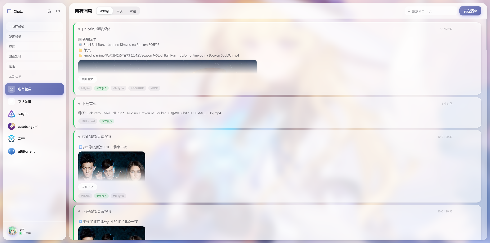

# Chatz

> **English**: [README.en.md](README.en.md) ｜ 文档英文版见 [docs/](docs/)

自托管的**通知路由中心**。Webhook 收消息，路由规则分发，频道订阅投递，多端状态实时同步。

```text
┌──────────────────────────────────────────────────────────┐
│                                                          │
│  GitHub ─┐                                               │
│  Uptime ─┼──▶ Webhook ──▶ 路由规则 ──▶ 频道 ──▶ Web / Android
│  Grafana ┘    (模板)      (条件+动作)   (订阅)   (实时推送)  │
│                                                          │
└──────────────────────────────────────────────────────────┘
```

## 界面预览



## 核心特性

| 特性 | 说明 |
|---|---|
| **多用户** | 用户名密码登录；每用户一枚登录 Token（反复登录复用，可自助更换） |
| **频道** | 应用发消息到频道，用户订阅频道；一个频道多人共享；频道名允许重名（靠 ID 区分） |
| **频道订阅密码** | 频道可设密码，订阅需输入（创建者/超管免密）；发现频道支持按名字/ID 搜索 |
| **应用 / 规则按用户隔离** | 人人都能管自己的应用和路由规则，互相看不见（**管理员也没有**全局特权）；规则只作用于自己的消息 |
| **消息状态同步** | 已读、未读、收藏、删除全端实时同步（WebSocket 广播） |
| **Webhook + 模板** | 接第三方（GitHub、Uptime Kuma、Grafana…），Mustache 风格渲染成可读通知 |
| **路由规则引擎** | 11 种条件 × 8 种动作：改优先级、加标签、静默、转发、丢弃、回调 |
| **消息聚合** | 同频道、同应用、同标题、5 分钟窗口内的消息自动折叠成一条（单条最长 30 分钟防「无限续命」，见 `AGG_MAX_LIFETIME_MS`；聚合主卡不显示封面，图在展开的子项里） |
| **附件** | 图片/文件传到 `/attachments/`，正文或 `extras` 引用；删消息时自动回收 |
| **自定义背景** | 每个用户上传自己的背景图，主题色自动从图里提取 |
| **HTTPS 内置** | 上传证书即可开启 WSS，支持热更新 |
| **中英双语界面** | 网页端支持中文 / 英文，跟随浏览器语言，侧栏「EN / 中」随时切（词典在 `public/i18n.js`） |
| **审计日志** | 登录、注册、改规则、删消息等关键操作留痕，管理员可查 |
| **Android 兼容** | 保留 Gotify 协议，旧客户端开箱即用 |

### 三种角色

| role | 叫法 | 能做什么 |
|---|---|---|
| 0 | 普通用户 | 自己订阅的频道 + **管自己的应用和路由规则** |
| 1 | 管理员 | 同上（应用 / 规则已按用户隔离，管理员**没有**全局特权）；看不到未订阅的私有频道 |
| 2 | 超级管理员 | 证书 / 审计 / 频道管理 + **提升他人** + **管理页**看全站（日常界面也只看自己的） |

> 📌 2026-10-01 起：**应用和路由规则改为按用户隔离**。所有登录用户都能建自己的应用和
> 路由规则，但每人只看得到自己创建的（管理员也看不到别人的）。规则**只作用于自己的消息**。
> 超管要看全站谁建了什么，去侧栏「管理」页（接口 `GET /admin/*`）。

首次创建的那个账号就是**超级管理员**（老实例升级后自动从 `is_admin` 迁移过来）。
要给别人权限，去「账户 → 用户管理」改角色。

### ⚠️ 「私有频道」对谁私有？

`is_public = false` 对**所有人**都生效 —— 看不到、订阅不了别人的私有频道，
**超管也不例外**（2026-10-01 收窄）。

以前超管是「全知」：能列出全部频道、读取任意频道的消息。代价是他的抽屉里塞满别人的频道、
还跟着一堆别人的频道更新事件（费电、吵）。现在这个能力收回了：

- **日常接口一律按订阅**：`GET /channel`、`GET /channel/:id`、`GET /message`、
  `GET /message/search`、`GET /message/deleted`、`POST /message/read-all`
  —— 超管看到的和其他人一样，只有自己订阅的。
- **全站数据改到管理页**：侧栏「管理」（`GET /admin/channels|applications|routes`），
  能看全站频道 / 应用 / 路由规则，并标出归属用户。
- 频道元信息广播（`channelCreated/Updated/Deleted`）的收件人早已收窄成
  「订阅者 ∪ 创建者」，超管不再全收。

好处是超管的日常界面终于清静了。代价是排障时不能直接看到用户的频道内容 ——
需要的话在管理页看频道列表，或临时订阅那个频道。

**不要把超级管理员账号交给你不完全信任的人** —— 想分摊运维就给「管理员」，
那个角色碰不到别人的私有频道，也看不到别人的应用和规则。

## 快速开始

### 环境要求

- Docker 20+
- Docker Compose v2
- （可选）已备案域名 + SSL 证书

### 部署：三种方式，选一种

仓库里的 `docker-compose.yml` 默认是**方式一**（`image: ghcr.io/yezi8430/chatz:latest`，
`build: .` 是注释掉的）。想改源码自己编才用方式二；连 compose 都不想碰就用方式三。

#### 方式一：docker compose + GHCR 镜像（默认，推荐）

每次推到主分支，GitHub Actions 会自动构建并推送到 `ghcr.io/yezi8430/chatz`
（镜像是 `linux/amd64`）。

```bash
git clone https://github.com/yezi8430/Chatz.git chatz
cd chatz
docker compose up -d
```

升级（出新版本后）：

```bash
docker compose pull && docker compose up -d
```

不需要 `--build` —— 这条路线根本没有本地构建这一步。

#### 方式二：docker compose + 本地编译（改源码时用）

先把 `docker-compose.yml` 改成这样（`image` 与 `build` **只能留一个**）：

```yaml
services:
  chatz:
    # image: ghcr.io/yezi8430/chatz:latest   ← 注释掉
    build: .                                 ← 放开这行
    container_name: chatz
    ...
```

然后：

```bash
docker compose up -d --build
```

改了 `src/` 或 `public/` 之后**必须重新 `--build`**：这两目录是 `COPY` 进镜像的，
只 `restart` 不会生效（前端还要顺手硬刷新一次浏览器）。

> 🔴 **方式一和方式二不要同时开着。** `image:` 和 `build:` 同时存在时，本地构建出来的镜像会被
> 打上 `ghcr.io/yezi8430/chatz:latest` 这个标签、把远端镜像顶掉，之后
> `docker compose pull` 只会回一句 `Skipped - No image to be pulled`（**不报错**），
> 你以为在升级，其实一直在跑自己那份旧构建。

#### 方式三：docker run（不用 compose、不用 clone）

只要一个容器、不想维护 compose 文件时：

```bash
docker run -d --name chatz \
  -p 20010:20010 \
  -p 20443:20443 \
  -v ./data:/app/data \
  -e TRUST_PROXY=auto \
  --restart unless-stopped \
  ghcr.io/yezi8430/chatz:latest

# 确认起来了
curl http://<你的服务器IP>:20010/health   # → {"ok":true,...}
docker logs chatz --tail 30               # 或者直接看启动日志
```

> 🔑 **不用从日志里捞 Token。** 完整值只在**首次启动**那一回打印一次，之后每次启动
> 只打 8 位指纹（`· 指纹 kR9m2pQ…`）—— 这是有意的，免得密钥长期留在 `docker logs` 里。
> 需要时到网页端「账户 → 安全与登录 → 登录设备」，点「默认 Token」那行的复制按钮即可。

要注意的四点：

- **要改源码自己编**，先 `docker build -t chatz .`，再把上面最后一行换成 `chatz`。
- ⚠️ `-v ./data:/app/data` 用的是**绑定挂载**，跟 compose 默认一致 ——
  `data/` 就是数据库本体（账号 / Token / 消息全在里面），整目录打包即可备份迁移。
  别换成 named volume（`chatz-data:/app/data`），那样备份文档里的目录打包步骤就对不上了。
- `docker run` 没有 `env_file`，所有变量都得用 `-e` 写在命令行上；好处是不受 compose 里
  `environment:` 优先级的影响，代价是**改变量必须重建容器**：`docker rm -f chatz` 再跑一遍
  上面的命令（`docker restart` 改不了 `-e`）。升级同理：
  `docker pull ghcr.io/yezi8430/chatz:latest` 后重建，数据目录不会被删。
- `20443` 是内置 HTTPS 端口（上传证书后用），用不到可以不映射。

> 标签策略：主分支打 `latest` + `sha-<短提交号>`；打 `v1.2.3` 这种标签时还会出
> `1.2.3` / `1.2`。**回滚靠 `sha-xxxx` 那个标签** —— 只认 `latest` 的话回滚是碰运气。

打开 `http://<你的服务器IP>:20010/` → 首次引导页 → 自己填管理员用户名和密码，
点「创建管理员」就能用。**不用 `docker logs`，不用找 Token。**

> **`.env` 是可选的**：compose 里写的是 `required: false`，文件不存在时 Compose 静默跳过，
> 所以新装只要 `clone` + `up` 两步。想自定义变量时再 `cp .env.example .env`。
> ⚠️ 从样例复制出来的每一行**行首都带 `#`**（= 不生效）。要启用哪个变量，
> **删掉那一行的 `#`** —— 留着 `#` 的值跟没写一样，而且不报任何错。
> 自查：`docker compose config | grep 变量名`。改完还要 `docker compose up -d --force-recreate`
> （`restart` 不重读 env_file）。
> ⚠️ 这个写法要求 Docker Compose **≥ 2.24.0**；更老的版本改用一个空的 `.env` 文件即可。

启动后日志长这样（已跑过一次的稳定状态）：

```text
──────── 启动 2026-09-29 00:22:03 ────────
✅ Chatz 已启动，监听端口 20010
   数据目录: /app/data/app.db
   网页版: http://<主机>:20010/
   推送接口: http://<主机>:20010/hook/<应用Token>
   消息聚合窗口: 300000ms（单条最长寿命 1800000ms）
   🛡️  TRUST_PROXY=auto  →  只信任来自本机 / 内网的代理

🔑 AUTH_TOKEN 就绪 [环境变量] · 指纹 kR9mX2pQ…
   完整值见 .env 里的 AUTH_TOKEN
──────── 就绪 ────────
```

> `TRUST_PROXY` 这行跟你在 compose / `.env` 里配的值走：`docker-compose.yml` 写死了
> `TRUST_PROXY=auto`，所以出厂就上面这样；**完全不配**时才会显示
> `TRUST_PROXY=off → 限速 / 审计只认 TCP 对端地址`，并且多打一行提醒你前面挂了反代要改。

> 服务端还会自动生成一枚 `AUTH_TOKEN`（存数据库 `meta` 表），给 Gotify 客户端和
> webhook 客户端用。网页端不用管它 —— 需要时到「账户 → 安全与登录 → 登录设备」
> 点「默认 Token」那行的复制按钮即可。
> Token 的完整打印规则、怎么从数据库取回，见
> [部署指南「启动日志都打印什么」](docs/DEPLOY.md#启动日志都打印什么)。

#### 主密钥要不要写进 `.env`？

**不用写**，默认就走数据库（引导页生成后落在 `data/app.db` 的 `meta` 表）。
`.env` 里的 `AUTH_TOKEN` 只在一种情况下需要：无头 / 自动化部署，没有浏览器去走引导页。

要手动指定时有两条路：

| 写法 | 环境变量里出现的是 | 说明 |
|---|---|---|
| `AUTH_TOKEN_FILE=/run/secrets/chatz_auth_token` | 只有一个**路径** | ✅ 推荐。密钥在挂载进来的文件里，可以 `chmod 600`，也能对接 docker secret / k8s secret |
| `AUTH_TOKEN=cz.xxxx` | **明文密钥** | ⚠️ `docker inspect`、`docker compose config`、面板和监控系统都会把它显示/采集出来 |

> 环境变量的暴露面比文件大得多：`docker inspect` 原样打印整个 env，`docker compose config`
> 会回显，`/proc/<pid>/environ` 同主机可读。所以有得选的时候用文件。
>
> ⚠️ `AUTH_TOKEN_FILE` 指向的文件读不到 / 是空的 ⇒ 服务端**拒绝启动**，
> 不会悄悄回落到数据库里的旧值（「以为换了密钥其实没换」比起不来难查）。

已经在用 `AUTH_TOKEN`、想改成文件或者干脆删掉：**值不会变**。启动时服务端会把
「这次实际生效的值」同步进数据库，之后来源变成 `[数据库]` 也是同一个密钥。
操作顺序见 `.env.example` 里「想把 AUTH_TOKEN 从 .env 里去掉？」那一节。

### 首次登录后建议

1. **建频道**：侧栏「+ 新建频道」，比如「工作」「家庭」「监控」
2. **加规则**：侧栏「路由规则」→「从模板创建」→ 选「Uptime Kuma 告警升级」
3. **配 Webhook**：侧栏「应用」→ 复制 Webhook URL，形如 `http://<IP>:20010/hook/<app-token>`
4. **接第三方**：
   - Uptime Kuma：通知设置 → Webhook → URL 填上面的
   - GitHub：仓库 Settings → Webhooks → Payload URL 填上面的
   - Grafana：Alerting → Contact points → Webhook

## 发一条消息

`<app-token>` 在网页端侧栏「应用」→ 复制 Webhook URL，或用
`GET /application` 接口取。

```bash
# 最简
curl -d "服务器挂了" http://<host>:20010/hook/<app-token>

# 带标题、优先级、频道
curl -d "CPU 95%" "http://<host>:20010/hook/<app-token>?priority=9&title=紧急&channel_id=1"

# 静默（不弹通知）
curl -d "心跳正常" "http://<host>:20010/hook/<app-token>?silent=true"

# 表单方式（qBittorrent 这类常用 curl -F，文件名带空格/引号时比拼 JSON 安全）
curl -F "title=下载完成" -F "message=xxx.mkv" -F "priority=5" \
  http://<host>:20010/hook/<app-token>

# JSON（兼容旧用法）
curl -H "Content-Type: application/json" \
  -d '{"message":"hello","priority":5}' \
  http://<host>:20010/hook/<app-token>
```

程序里调用用 API 方式（需登录 Token）：

```bash
curl -X POST http://<host>:20010/message \
  -H "Authorization: Bearer <auth-token>" \
  -H "Content-Type: application/json" \
  -d '{"title":"标题","message":"内容","priority":5}'
```

完整参数、响应字段、WebSocket 协议见 [API 参考](docs/API.md)。

## 常用场景

| 场景 | 怎么做 |
|---|---|
| **服务器监控告警** | Uptime Kuma → Webhook → Chatz。配规则「优先级 ≥ 8 时同时转发到运维频道」 |
| **GitHub 事件** | 仓库 Settings → Webhooks → Chatz，配一个模板（见[模板语法](docs/TEMPLATE.md)） |
| **家庭共享** | 每人一个账号 + 一个「家庭」频道，冰箱 / NAS / 树莓派的告警都发这里 |
| **静默降噪** | 规则里选模板「半夜静默」：23:00–07:00 优先级 ≤ 7 自动静默 |

## 客户端

**Web** —— 浏览器打开 `http://<host>:20010/`，用户名密码或 Token 登录。

**Android 方案 A：官方 Gotify 客户端**

1. 下载 Gotify for Android
2. 服务器地址：`http://<host>:20010`
3. Client Token：`.env` 里的 `AUTH_TOKEN` 或用户设备 Token
4. 点「测试」→ 应该显示成功

**Android 方案 B：自研客户端** —— 参考 [docs/API.md](docs/API.md) 的 WebSocket 协议实现。

**命令行** —— 就是上面「发一条消息」那几个 `curl`。

## 目录结构

```text
chatz/
├── Dockerfile
├── docker-compose.yml
├── .dockerignore             # COPY 不看 .gitignore —— 挡住 *.bak 和 data/ 进镜像
├── package.json
├── .env.example              # 环境变量样例 → cp 成 .env 即可用
├── .env                      # 可选。存在则读取，不存在也能正常启动
├── .gitignore                # 排除 .env 和 data/，别把密钥和数据库提交上去
├── src/
│   ├── index.js              # HTTP 主入口：静态资源、应用、消息列表、审计
│   ├── db.js                 # SQLite 初始化（建 v1 骨架表）
│   ├── migrate.js            # 迁移 + AUTH_TOKEN 解析 + 管理员初始化
│   ├── ws.js                 # WebSocket 广播
│   ├── auth.js               # 鉴权（设备 Token / AUTH_TOKEN）
│   ├── tokenGen.js           # Token 生成器（应用 Token / 设备 Token）
│   ├── channels.js           # 频道 API
│   ├── messages.js           # 已读 / 收藏 / 搜索 / 未读数 API
│   ├── users.js              # 用户 / 设备 / 头像 / 昵称 API
│   ├── routes-api.js         # 路由规则 API + 预置模板
│   ├── admin-api.js          # 超管管理页 API（/admin/*，全站只读）
│   ├── routing.js            # 路由引擎（条件 + 动作）
│   ├── template.js           # Mustache 风格模板引擎
│   ├── hooks.js              # Webhook 入口（含 multipart 解析）
│   ├── messageCreate.js      # 统一消息创建：清理 → 路由 → 聚合 → 落库 → 广播
│   ├── certs.js              # HTTPS 证书管理
│   ├── background.js         # 用户背景管理
│   ├── attachments.js        # 附件上传 + 孤儿清理
│   ├── rateLimit.js          # 内存限速（每个实例独立计数，见文件头说明）
│   ├── clientIp.js           # 客户端 IP 判定（限速和审计共用，见 TRUST_PROXY）
│   ├── securityHeaders.js    # 安全响应头 + CSP
│   ├── sanitize.js           # 图片魔数识别
│   ├── reset-password.js     # 命令行重置密码（忘了密码时的逃生口）
│   └── audit.js              # 审计日志（写入 / 节流 / 裁剪）
├── public/                   # 前端（无构建工具）
│   ├── index.html
│   ├── boot.js               # 首屏脚本（外置，CSP 不允许内联脚本）
│   ├── app.js
│   └── style.css
├── docs/
│   ├── API.md
│   ├── TEMPLATE.md
│   ├── ROUTES.md
│   ├── DEPLOY.md
│   └── screenshots/        # README / 文档里用到的界面截图
└── data/                     # 持久化目录（挂载到容器）
    ├── app.db                # SQLite 数据库
    ├── icons/                # 应用图标
    ├── channel-icons/        # 频道图标
    ├── user-avatars/         # 用户头像
    ├── attachments/          # 消息附件
    ├── background/           # 用户背景
    │   └── user-1/
    └── certs/                # HTTPS 证书（fullchain.pem / privkey.pem）
```

## 技术栈

- 后端：Node.js 20、Express 4、ws 8、better-sqlite3 11
- 数据库：SQLite（WAL 模式，单文件）
- 前端：纯 HTML + CSS + 原生 JS
- 容器：Docker + Compose

没有：Redis、Postgres、消息队列、Kafka、任何外部依赖。

## 文档

| 文档 | 什么时候看 |
|---|---|
| [API 参考](docs/API.md) | 写脚本调接口、实现客户端、查字段含义与错误码 |
| [模板语法](docs/TEMPLATE.md) | 配 Webhook 模板，把第三方 JSON 渲染成可读通知 |
| [路由规则](docs/ROUTES.md) | 配「条件 + 动作」，做转发 / 静默 / 改优先级 / 丢弃 |
| [部署指南](docs/DEPLOY.md) | 上生产：反代、HTTPS、备份恢复、排障 |

英文版：[README.en.md](README.en.md)；文档英文版：`ROUTES` / `TEMPLATE` / `RELEASE` 是完整翻译，
`API` / `DEPLOY` 目前是章节级英文目录（见各自目录下的 `.en.md`）。

部署指南里几个高频入口：

- [环境变量](docs/DEPLOY.md#环境变量) —— 全部变量清单，含 `TRUST_PROXY` 该怎么设
- [启动日志都打印什么](docs/DEPLOY.md#启动日志都打印什么) —— Token 什么时候打完整值、怎么取回
- [日常运维命令](docs/DEPLOY.md#日常运维命令) —— 启停 / 重建 / 查数据库
- [常见问题](docs/DEPLOY.md#常见问题) —— 排障
- [安全加固](docs/DEPLOY.md#安全加固) —— 上线前该做的事
- [本地开发](docs/DEPLOY.md#本地开发) —— 不用 Docker 直接跑

## 许可

**服务端** 与 **Android 客户端** 使用 **[MIT](LICENSE)**：

> Copyright (c) 2026 yezi

可以任意使用、修改、再发布（**包括商用和闭源**），唯一要求是**保留版权声明和许可文本**。
软件按「原样」提供，不含任何担保。

⚠️ **Jellyfin 插件不适用 MIT。** 插件引用了 `Jellyfin.Common` / `Jellyfin.Controller` /
`Jellyfin.Model`，这些都是 **GPL-2.0-or-later**，而加载进 Jellyfin 进程的插件可能被视为 GPL
派生作品 ⇒ 插件单独采用 **GPL-2.0-or-later**（见插件目录下的 `LICENSE`）。

### 第三方

- 运行时依赖：`express`、`ws`、`better-sqlite3` —— 均为 MIT
- 前端从 CDN 加载（**不包含在本仓库内**）：[DOMPurify](https://github.com/cure53/DOMPurify) 3.0.6
  （MPL-2.0 或 Apache-2.0 双许可）、[marked](https://github.com/markedjs/marked) 12.0.2（MIT）
